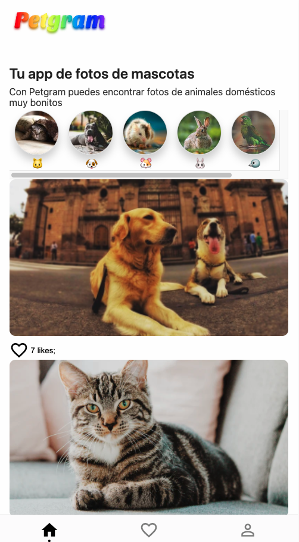

# curso-platzi-react-avanzado ⚛️

Repositorio con el código del [Curso Avanzado de React de Platzi](https://platzi.com/cursos/react-avanzado/)

## App Preview


## Qué aprendí en este curso?
* Creación y configuración de un proyecto React desde cero, utilizando webpack y babel
* Profundizar en la utilización de hooks
* Creación de hooks personalizados
* Convertir un proyecto de React en PWA
* Incluir SEO en una aplicación con React
* Integración de React con GraphQL
* Querys y Mutaciones GrahpQL

## Para correr el proyecto:

primero, instalar las dependencias del proyecto:

```npm install```

correr en modo desarrollo:

```npm run dev```